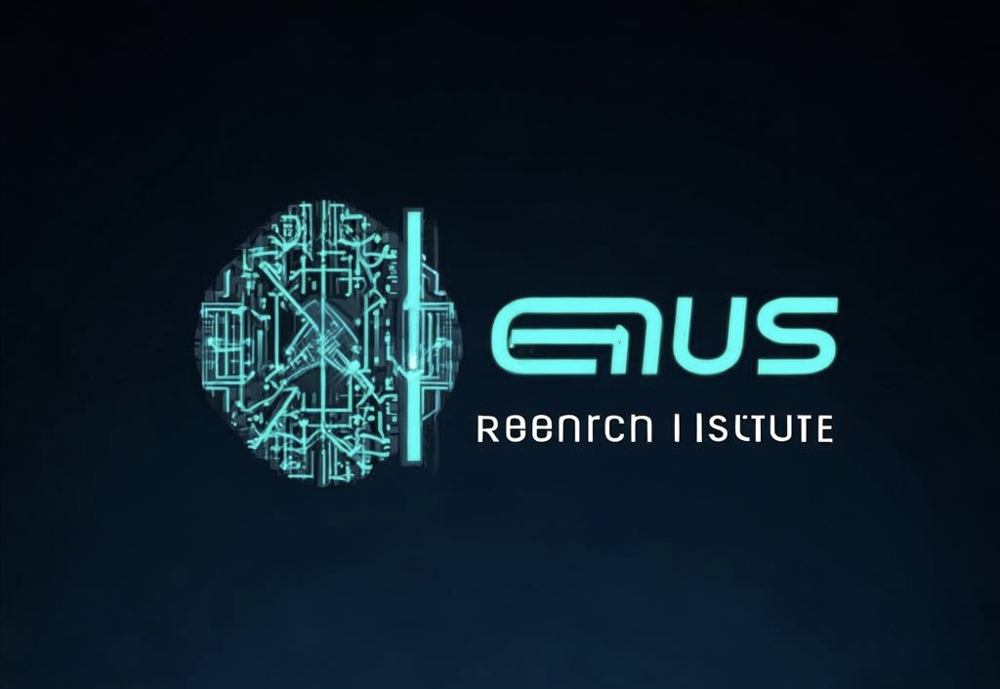

# 通往通用人工智能AGI之路

> The Road To Artificial General Intelligence AGI

陈光剑 编著

AI 天才研究院 / AI Genius Institute, 2024

----

 
# 第一部分: AGI的基础与发展

#  [第1章: 通用人工智能(AGI)概述](%E7%AC%AC1%E7%AB%A0%3A%20%E9%80%9A%E7%94%A8%E4%BA%BA%E5%B7%A5%E6%99%BA%E8%83%BD%28AGI%29%E6%A6%82%E8%BF%B0.md)

## 1.1 AGI的定义与特征
### 1.1.1 AGI与narrow AI的区别
### 1.1.2 AGI的核心能力
### 1.1.3 AGI的潜在影响

## 1.2 AGI发展简史
### 1.2.1 早期AI研究
### 1.2.2 AI冬季与复兴
### 1.2.3 深度学习革命

## 1.3 当前AGI研究的主要方向
### 1.3.1 符号主义
### 1.3.2 连接主义
### 1.3.3 混合方法

#  [第2章: AGI的理论基础](%E7%AC%AC2%E7%AB%A0%3A%20AGI%E7%9A%84%E7%90%86%E8%AE%BA%E5%9F%BA%E7%A1%80.md)

## 2.1 计算理论
### 2.1.1 图灵机与计算能力
### 2.1.2 复杂性理论
### 2.1.3 可计算性与AGI

## 2.2 认知科学与心理学
### 2.2.1 人类认知过程
### 2.2.2 记忆与学习理论
### 2.2.3 推理与决策模型

## 2.3 神经科学
### 2.3.1 大脑结构与功能
### 2.3.2 神经可塑性
### 2.3.3 大脑计算模型

#  [第3章: 机器学习与深度学习基础](%E7%AC%AC3%E7%AB%A0%3A%20%E6%9C%BA%E5%99%A8%E5%AD%A6%E4%B9%A0%E4%B8%8E%E6%B7%B1%E5%BA%A6%E5%AD%A6%E4%B9%A0%E5%9F%BA%E7%A1%80.md)

## 3.1 机器学习概述
### 3.1.1 监督学习
### 3.1.2 无监督学习
### 3.1.3 强化学习

## 3.2 深度学习核心概念
### 3.2.1 神经网络基础
### 3.2.2 卷积神经网络
### 3.2.3 循环神经网络

## 3.3 迁移学习与元学习
### 3.3.1 迁移学习原理
### 3.3.2 元学习方法
### 3.3.3 少样本学习

# 第二部分: AGI关键技术

#  [第4章: 大规模语言模型](%E7%AC%AC4%E7%AB%A0%3A%20%E5%A4%A7%E8%A7%84%E6%A8%A1%E8%AF%AD%E8%A8%80%E6%A8%A1%E5%9E%8B.md)

## 4.1 Transformer架构
### 4.1.1 自注意力机制
### 4.1.2 位置编码
### 4.1.3 多头注意力

## 4.2 预训练语言模型
### 4.2.1 BERT及其变体
### 4.2.2 GPT系列模型
### 4.2.3 T5与统一文本到文本框架

## 4.3 大规模模型训练技术
### 4.3.1 分布式训练
### 4.3.2 混合精度训练
### 4.3.3 梯度累积与模型并行

#  [第5章: 多模态学习](%E7%AC%AC5%E7%AB%A0%3A%20%E5%A4%9A%E6%A8%A1%E6%80%81%E5%AD%A6%E4%B9%A0.md)

## 5.1 视觉-语言模型
### 5.1.1 图像描述生成
### 5.1.2 视觉问答
### 5.1.3 视觉推理

## 5.2 跨模态表示学习
### 5.2.1 联合嵌入
### 5.2.2 对比学习
### 5.2.3 自监督学习方法

## 5.3 多模态融合技术
### 5.3.1 早期融合
### 5.3.2 晚期融合
### 5.3.3 动态融合机制

#  [第6章: 推理与规划](%E7%AC%AC6%E7%AB%A0%3A%20%E6%8E%A8%E7%90%86%E4%B8%8E%E8%A7%84%E5%88%92.md)

## 6.1 符号推理
### 6.1.1 一阶逻辑
### 6.1.2 概率图模型
### 6.1.3 因果推理

## 6.2 神经符号推理
### 6.2.1 神经逻辑编程
### 6.2.2 神经定理证明
### 6.2.3 可微分推理

## 6.3 规划与决策制定
### 6.3.1 经典规划算法
### 6.3.2 分层强化学习
### 6.3.3 模型预测控制

#  [第7章: 持续学习与适应](%E7%AC%AC7%E7%AB%A0%3A%20%E6%8C%81%E7%BB%AD%E5%AD%A6%E4%B9%A0%E4%B8%8E%E9%80%82%E5%BA%94.md)

## 7.1 终身学习
### 7.1.1 灾难性遗忘问题
### 7.1.2 渐进式学习
### 7.1.3 经验回放技术

## 7.2 元学习与快速适应
### 7.2.1 模型无关元学习
### 7.2.2 基于梯度的元学习
### 7.2.3 上下文适应

## 7.3 自主学习
### 7.3.1 好奇心驱动学习
### 7.3.2 主动学习策略
### 7.3.3 自我监督学习

# 第三部分: AGI系统架构与实现

#  [第8章: 认知架构](%E7%AC%AC8%E7%AB%A0%3A%20%E8%AE%A4%E7%9F%A5%E6%9E%B6%E6%9E%84.md)

## 8.1 经典认知架构
### 8.1.1 ACT-R
### 8.1.2 SOAR
### 8.1.3 CLARION

## 8.2 神经认知架构
### 8.2.1 Spaun
### 8.2.2 Neural Turing Machines
### 8.2.3 Differentiable Neural Computers

## 8.3 混合认知架构
### 8.3.1 NARS
### 8.3.2 OpenCog
### 8.3.3 LIDA

#  [第9章: 大规模AGI系统设计](%E7%AC%AC9%E7%AB%A0%3A%20%E5%A4%A7%E8%A7%84%E6%A8%A1AGI%E7%B3%BB%E7%BB%9F%E8%AE%BE%E8%AE%A1.md)

## 9.1 系统级架构
### 9.1.1 模块化设计
### 9.1.2 分布式计算框架
### 9.1.3 内存管理与知识表示

## 9.2 学习与推理引擎
### 9.2.1 多任务学习系统
### 9.2.2 元控制器设计
### 9.2.3 自适应算法选择

## 9.3 交互与环境接口
### 9.3.1 多模态感知系统
### 9.3.2 自然语言交互
### 9.3.3 虚拟与物理环境适配

#  [第10章: AGI评估与测试](%E7%AC%AC10%E7%AB%A0%3A%20AGI%E8%AF%84%E4%BC%B0%E4%B8%8E%E6%B5%8B%E8%AF%95.md)

## 10.1 智能测试理论
### 10.1.1 图灵测试及其变体
### 10.1.2 通用智能量化方法
### 10.1.3 认知任务电池

## 10.2 AGI基准测试
### 10.2.1 多任务学习基准
### 10.2.2 常识推理测试
### 10.2.3 开放域对话评估

## 10.3 安全性与伦理测试
### 10.3.1 价值对齐验证
### 10.3.2 偏见与公平性测试
### 10.3.3 长期影响评估

# 第四部分: AGI的挑战与未来

#  [第11章: AGI面临的技术挑战](%E7%AC%AC11%E7%AB%A0%3A%20AGI%E9%9D%A2%E4%B8%B4%E7%9A%84%E6%8A%80%E6%9C%AF%E6%8C%91%E6%88%98.md)

## 11.1 可解释性与透明度
### 11.1.1 黑盒模型解释技术
### 11.1.2 可解释AI架构
### 11.1.3 决策过程追踪

## 11.2 鲁棒性与泛化能力
### 11.2.1 对抗样本防御
### 11.2.2 域外泛化
### 11.2.3 长尾分布学习

## 11.3 效率与可扩展性
### 11.3.1 计算资源优化
### 11.3.2 模型压缩技术
### 11.3.3 硬件协同设计

#  [第12章: AGI的伦理与安全](%E7%AC%AC12%E7%AB%A0%3A%20AGI%E7%9A%84%E4%BC%A6%E7%90%86%E4%B8%8E%E5%AE%89%E5%85%A8.md)

## 12.1 AI伦理框架
### 12.1.1 价值对齐问题
### 12.1.2 道德决策模型
### 12.1.3 伦理准则制定

## 12.2 AGI安全策略
### 12.2.1 控制问题
### 12.2.2 封装与沙盒技术
### 12.2.3 多级安全机制

## 12.3 社会影响与政策考量
### 12.3.1 就业与经济影响
### 12.3.2 隐私与数据权
### 12.3.3 国际合作与治理

#  [第13章: AGI研究前沿与未来展望](%E7%AC%AC13%E7%AB%A0%3A%20AGI%E7%A0%94%E7%A9%B6%E5%89%8D%E6%B2%BF%E4%B8%8E%E6%9C%AA%E6%9D%A5%E5%B1%95%E6%9C%9B.md)

## 13.1 新兴AGI理论与方法
### 13.1.1 意识与自我模型
### 13.1.2 创造力与想象力建模
### 13.1.3 情感与社会智能

## 13.2 跨学科融合趋势
### 13.2.1 认知科学与AI的深度整合
### 13.2.2 类脑计算与神经形态工程
### 13.2.3 量子计算在AGI中的应用

## 13.3 AGI发展路线图
### 13.3.1 近期里程碑
### 13.3.2 中期发展目标
### 13.3.3 长期愿景与超级智能

#  [附录](%E9%99%84%E5%BD%95.md)

## 附录A: AGI相关数学基础
## 附录B: 重要AGI研究机构与项目
## 附录C: AGI相关开源工具与平台
## 附录D: 术语表
## 附录E: 参考文献

----

# 捐赠：AI天才研究院

> Donate to AI Genius Institute:

| 微信                                                      | 支付宝                                                     |
|---------------------------------------------------------|---------------------------------------------------------|
|  |  |
